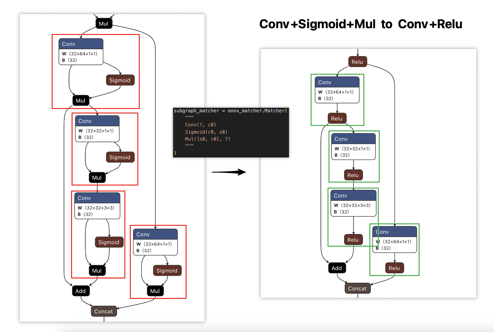

# ONNX Pattern Matcher
Using **pattern matcher** in onnx model for subgraph match and replace.



# Get Start
- Python Code: [happy_onnx_modify.py](happy_onnx_modify.py)
```python
def conv_swish_to_conv_relu(i, subgraph):
    conv = subgraph[0]
    mul  = subgraph[2]
    relu = helper.make_node("Relu", inputs=conv.output, outputs=mul.output, name=f"{conv.output[0]}_relu")
    return [conv, relu], []


# Define a subgraph pattern.
subgraph_matcher = onnx_matcher.Matcher(
    """
    Conv(?, c0)
    Sigmoid(c0, s0)
    Mul([s0, c0], ?)
    """
)

# Replace all conv+sigmoid+mul to conv+relu.
subgraph_matcher.replace(model, conv_swish_to_conv_relu)
```

- Run demo:
```bash
$> python happy_onnx_modify.py
```

# Subsraph Rules
```python
layername1/layername2([input_argument1, input_argument2], [output_argument1, output_argument2])
layername(input_argument, output_argument)

where:
   ? will match any layer or argument.

For example1:
    """
    Conv(?, c0)
    Sigmoid(c0, s0)
    Mul([s0, c0], ?)
    """

For example2:
    """
    Conv/Avgpool(?, c0)
    ?(c0, s0)
    Mul([s0, c0], ?)
    """
```

# Reference
- No reference